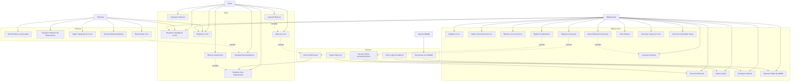
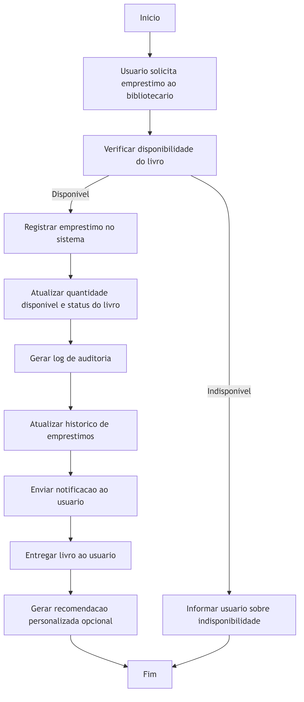

# ANEXO III - DIAGRAMAS UML

**Projeto:** BiblioKopke - Sistema de Gestão de Biblioteca Escolar
**Metodologia:** UML (Unified Modeling Language) 2.5

---

## Índice de Diagramas

1. [Diagrama de Casos de Uso](#1-diagrama-de-casos-de-uso)
2. [Diagrama de Classes](#2-diagrama-de-classes)
3. [Diagrama de Sequência - Empréstimo](#3-diagrama-de-sequência---empréstimo)
4. [Diagrama de Atividades - Empréstimo](#4-diagrama-de-atividades---empréstimo)

---

## 1. Diagrama de Casos de Uso

### Descrição
O diagrama de casos de uso apresenta as funcionalidades do sistema BiblioKopke sob a perspectiva dos três principais atores: **Aluno**, **Professor** e **Bibliotecário**, além da integração com o **Sistema SIMADE**.

### Imagem



### Atores

#### Aluno
- Visualizar Catálogo de Livros
- Pesquisar Livros (por título, autor, categoria, ISBN)
- Reservar Livro (quando indisponível)
- Visualizar Seus Empréstimos (ativos e histórico)
- Renovar Empréstimo (até 2 vezes)
- Consultar Histórico de Empréstimos
- Cancelar Reserva

#### Professor
- Visualizar Catálogo de Livros
- Pesquisar Livros
- Solicitar Reserva para Aulas (múltiplos exemplares)
- Visualizar Histórico de Empréstimos
- Sugerir Aquisição de Livros (para bibliotecário)
- Acessar Relatórios Básicos

#### Bibliotecário
- **Gestão do Acervo:**
  - Cadastrar Livro
  - Editar Informações do Livro
  - Remover Livro do Acervo
  - Visualizar Catálogo Completo
  - Pesquisar Livros

- **Gestão de Empréstimos:**
  - Registrar Empréstimo
  - Registrar Devolução
  - Calcular Multas
  - Aplicar Multas

- **Gestão de Reservas:**
  - Gerenciar Reservas (aprovar, cancelar, atender)
  - Notificar usuários de disponibilidade

- **Gestão de Usuários:**
  - Consultar Usuários
  - Importar Dados do SIMADE

- **Administração:**
  - Gerar Relatórios Gerenciais
  - Configurar Sistema
  - Fazer Backup
  - Visualizar Logs de Auditoria

#### Sistema SIMADE
- Sincronizar com SIMADE (integração automática)
- Enviar Notificações (e-mail/SMS quando configurado)
- Calcular Multas Automaticamente (trigger diário)
- Expirar Reservas (após validade)
- Gerar Logs de Auditoria (todas as operações)

### Relacionamentos

**Extends:** Indica funcionalidades opcionais ou excepcionais
- Reservar Livro → extends → Enviar Notificação
- Registrar Empréstimo → extends → Enviar Notificação
- Registrar Devolução → extends → Calcular Multa

**Includes:** Indica funcionalidades obrigatórias
- Renovar Empréstimo → includes → Visualizar Seus Empréstimos
- Cancelar Reserva → includes → Reservar Livro
- Gerar Relatórios → includes → Consultar Usuários

### Arquivo Fonte
- **Markdown:** [diagrama_casos_de_uso.md](../../04_diagramas/diagrama_casos_de_uso.md)
- **Mermaid:** [diagrama_casos_de_uso.mmd](../../04_diagramas/diagrama_casos_de_uso.mmd)
- **Imagem PNG:** [diagrama_casos_de_uso.png](../../04_diagramas/diagrama_casos_de_uso.png)

---

## 2. Diagrama de Classes

### Descrição
O diagrama de classes apresenta a estrutura estática do sistema, mostrando as classes principais, seus atributos, e os relacionamentos entre elas.

### Imagem


### Classes Principais

#### Usuario
**Atributos:**
- codigo_simade: int (PK - código do SIMADE)
- codigo_inep: String (código da escola)
- nome_completo: String
- data_nascimento: Date
- cpf: String
- email: String
- telefone: String
- endereco: String
- tipo_usuario: TipoUsuario (ALUNO, PROFESSOR, BIBLIOTECARIO)
- nome_filiacao: String (pais/responsáveis)
- cor_raca: CorRaca (enum IBGE)
- sexo: Sexo (enum)
- estado_civil: EstadoCivil (enum)
- nacionalidade: String
- uf_nascimento: String
- municipio_nascimento: String
- ativo: boolean
- data_cadastro: Date
- data_atualizacao: Date

**Relacionamentos:**
- 1:N com Emprestimo
- 1:N com Reserva
- 1:N com HistoricoEmprestimo
- 1:N com LogSistema
- 1:N com Relatorio

#### Livro
**Atributos:**
- id_livro: int (PK)
- isbn: String (UNIQUE)
- titulo: String
- autor: String
- editora: String
- ano_publicacao: int
- categoria: String
- numero_paginas: int
- idioma: String
- sinopse: Text
- localizacao: String (prateleira/estante)
- status: StatusLivro (enum)
- quantidade_total: int
- quantidade_disponivel: int
- data_cadastro: Date
- data_atualizacao: Date

**Relacionamentos:**
- 1:N com Emprestimo
- 1:N com Reserva
- 1:N com HistoricoEmprestimo

#### Emprestimo
**Atributos:**
- id_emprestimo: int (PK)
- codigo_simade: int (FK → Usuario)
- id_livro: int (FK → Livro)
- data_emprestimo: Date
- data_devolucao_prevista: Date
- data_devolucao_real: Date (nullable)
- status: StatusEmprestimo (enum)
- observacoes: Text
- renovacoes: int (contador)
- data_cadastro: Date

**Métodos (a serem implementados em C#):**
- realizarEmprestimo()
- realizarDevolucao()
- renovarEmprestimo()
- calcularDiasAtraso(): int
- calcularMulta(): decimal

**Relacionamentos:**
- N:1 com Usuario
- N:1 com Livro
- 1:1 com HistoricoEmprestimo (após devolução)

#### Reserva
**Atributos:**
- id_reserva: int (PK)
- codigo_simade: int (FK → Usuario)
- id_livro: int (FK → Livro)
- data_reserva: Date
- data_validade: Date
- status: StatusReserva (enum)
- motivo_cancelamento: Text (nullable)
- data_cadastro: Date

**Métodos:**
- criarReserva()
- cancelarReserva()
- atenderReserva()
- verificarExpiracao()

**Relacionamentos:**
- N:1 com Usuario
- N:1 com Livro

#### HistoricoEmprestimo
**Atributos:**
- id_historico: int (PK)
- id_emprestimo: int (FK → Emprestimo)
- codigo_simade: int (FK → Usuario)
- id_livro: int (FK → Livro)
- data_emprestimo: Date
- data_devolucao: Date
- dias_atraso: int
- multa: decimal(10,2)
- observacoes: Text
- data_registro: Date

**Relacionamentos:**
- N:1 com Emprestimo
- N:1 com Usuario
- N:1 com Livro

#### LogSistema
**Atributos:**
- id_log: int (PK)
- codigo_simade: int (FK → Usuario, nullable)
- tabela_afetada: String
- acao: AcaoLog (enum: INSERT, UPDATE, DELETE)
- dados_anteriores: JSON (nullable)
- dados_novos: JSON (nullable)
- ip_usuario: String
- data_acao: DateTime

**Relacionamentos:**
- N:1 com Usuario (opcional)

#### Relatorio
**Atributos:**
- id_relatorio: int (PK)
- tipo_relatorio: String
- periodo: String
- dados_relatorio: JSON
- codigo_simade: int (FK → Usuario)
- data_geracao: DateTime
- arquivo_gerado: String (caminho do PDF/CSV)

**Relacionamentos:**
- N:1 com Usuario

### Enumerações (Enums)

#### TipoUsuario
- ALUNO
- PROFESSOR
- BIBLIOTECARIO

#### CorRaca (IBGE)
- Branca
- Preta
- Parda
- Amarela
- Indígena
- Não_declarada

#### Sexo
- Masculino
- Feminino
- Outro

#### EstadoCivil
- Solteiro
- Casado
- Divorciado
- Viúvo

#### StatusLivro
- DISPONIVEL
- INDISPONIVEL
- MANUTENCAO

#### StatusEmprestimo
- ATIVO
- DEVOLVIDO
- ATRASADO
- RENOVADO

#### StatusReserva
- ATIVA
- CANCELADA
- ATENDIDA
- EXPIRADA

#### AcaoLog
- INSERT
- UPDATE
- DELETE

### Multiplicidades

```
Usuario (1) -----> (0..*) Emprestimo
Usuario (1) -----> (0..*) Reserva
Usuario (1) -----> (0..*) HistoricoEmprestimo
Usuario (1) -----> (0..*) LogSistema
Usuario (1) -----> (0..*) Relatorio

Livro (1) -----> (0..*) Emprestimo
Livro (1) -----> (0..*) Reserva
Livro (1) -----> (0..*) HistoricoEmprestimo

Emprestimo (1) -----> (0..1) HistoricoEmprestimo
```

### Arquivo Fonte
- **Markdown:** [diagrama_classes.md](../../04_diagramas/diagrama_classes.md)
- **Mermaid:** [diagrama_classes.mmd](../../04_diagramas/diagrama_classes.mmd)
- **Imagem PNG:** [diagrama_classes.png](../../04_diagramas/diagrama_classes.png)

---

## 3. Diagrama de Sequência - Empréstimo

### Descrição
O diagrama de sequência mostra a interação temporal entre os objetos durante o processo de empréstimo de um livro.

### Imagem


### Participantes

1. **Usuário (Aluno/Professor):** Solicita o empréstimo
2. **Bibliotecário:** Intermedia o processo
3. **Sistema:** Aplicação BiblioKopke (Desktop C#)
4. **Banco de Dados:** MySQL

### Fluxo Principal (Cenário de Sucesso)

```
1. Usuário → Bibliotecário: Solicita empréstimo de livro
2. Bibliotecário → Sistema: Inicia processo de empréstimo
   2.1. Sistema → Sistema: Valida código SIMADE do usuário
   2.2. Sistema → Sistema: Valida ID do livro
3. Sistema → Banco de Dados: Verifica disponibilidade do livro
   Query: SELECT quantidade_disponivel FROM livro WHERE id_livro = ?
4. Banco de Dados → Sistema: Livro disponível (quantidade > 0)
5. Sistema → Sistema: Valida regras de negócio
   5.1. Usuário está ativo?
   5.2. Usuário não excedeu limite de empréstimos?
   5.3. Usuário não tem empréstimos atrasados?
6. Sistema → Banco de Dados: Registra empréstimo
   INSERT INTO emprestimo (codigo_simade, id_livro, data_emprestimo, data_devolucao_prevista, status)
7. Banco de Dados → Banco de Dados: Trigger atualiza quantidade_disponivel
   UPDATE livro SET quantidade_disponivel = quantidade_disponivel - 1
8. Banco de Dados → Banco de Dados: Trigger gera log de auditoria
   INSERT INTO log_sistema (...)
9. Sistema → Bibliotecário: Confirmação de empréstimo realizado
   (Exibe comprovante com dados do empréstimo)
10. Bibliotecário → Usuário: Entrega livro e confirma empréstimo
```

### Fluxo Alternativo (Livro Indisponível)

```
1-3. (mesmos passos do fluxo principal)
4. Banco de Dados → Sistema: Livro indisponível (quantidade = 0)
5. Sistema → Sistema: Verifica se há reservas
6. Sistema → Bibliotecário: Informa indisponibilidade
   (Opção de criar reserva)
7. Bibliotecário → Usuário: Notifica sobre indisponibilidade
   7.1. (opcional) Oferece criar reserva
```

### Fluxo de Exceção (Validação Falha)

```
1-5. (mesmos passos até validação)
5.x. Sistema detecta violação de regra:
   - Usuário inativo
   - Limite de empréstimos excedido (3 para aluno, 5 para professor)
   - Usuário com empréstimos atrasados
6. Sistema → Bibliotecário: Mensagem de erro específica
7. Bibliotecário → Usuário: Informa motivo da recusa
```

### Arquivo Fonte
- **Markdown:** [diagrama_sequencia_emprestimo.md](../../04_diagramas/diagrama_sequencia_emprestimo.md)
- **Mermaid:** [diagrama_sequencia_emprestimo.mmd](../../04_diagramas/diagrama_sequencia_emprestimo.mmd)
- **Imagem PNG:** [diagrama_sequencia_emprestimo.png](../../04_diagramas/diagrama_sequencia_emprestimo.png)

---

## 4. Diagrama de Atividades - Empréstimo

### Descrição
O diagrama de atividades representa o fluxo de trabalho do processo de empréstimo, focando nas decisões e ações executadas.

### Imagem



### Fluxo de Atividades

```
┌─────────────────────────────────────────┐
│         [INÍCIO]                         │
└────────────┬────────────────────────────┘
             │
             ▼
┌─────────────────────────────────────────┐
│ Usuário solicita empréstimo              │
│ ao bibliotecário                         │
└────────────┬────────────────────────────┘
             │
             ▼
┌─────────────────────────────────────────┐
│ Bibliotecário inicia processo            │
│ no sistema                               │
└────────────┬────────────────────────────┘
             │
             ▼
┌─────────────────────────────────────────┐
│ Sistema verifica disponibilidade         │
│ do livro                                 │
└────────────┬────────────────────────────┘
             │
        ┌────┴────┐
        │         │
    [Disponível]  [Indisponível]
        │         │
        │         └──────────────────────────┐
        │                                    │
        ▼                                    ▼
┌──────────────────┐           ┌───────────────────────┐
│ Sistema valida   │           │ Sistema informa       │
│ regras de negócio│           │ indisponibilidade     │
└────────┬─────────┘           └──────────┬────────────┘
         │                                 │
    ┌────┴────┐                           │
    │         │                            │
[Válido]  [Inválido]                      │
    │         │                            │
    │         └───────────────┐            │
    │                         │            │
    ▼                         ▼            ▼
┌────────────────┐  ┌──────────────────────────────┐
│ Registra       │  │ Exibe mensagem de erro       │
│ empréstimo     │  │ (motivo da recusa)           │
└────────┬───────┘  └────────────┬─────────────────┘
         │                       │
         ▼                       │
┌────────────────┐              │
│ Atualiza       │              │
│ quantidade     │              │
│ disponível     │              │
└────────┬───────┘              │
         │                      │
         ▼                      │
┌────────────────┐              │
│ Gera log de    │              │
│ auditoria      │              │
└────────┬───────┘              │
         │                      │
         ▼                      │
┌────────────────┐              │
│ Entrega livro  │              │
│ ao usuário     │              │
└────────┬───────┘              │
         │                      │
         └──────────┬───────────┘
                    │
                    ▼
         ┌──────────────────┐
         │     [FIM]         │
         └──────────────────┘
```

### Pontos de Decisão

#### Decisão 1: Disponibilidade
- **Condição:** quantidade_disponivel > 0
- **Verdadeiro:** Prossegue para validação
- **Falso:** Informa indisponibilidade (opção de reserva)

#### Decisão 2: Validação de Regras
- **Condição:** Todas as regras satisfeitas
  - Usuário ativo = true
  - Empréstimos ativos < limite (3 aluno / 5 professor)
  - Sem empréstimos atrasados
- **Verdadeiro:** Registra empréstimo
- **Falso:** Exibe erro específico

### Atividades Automáticas (Triggers)
- **Atualizar quantidade disponível:** Trigger automático após INSERT em emprestimo
- **Gerar log de auditoria:** Trigger automático após operações críticas

### Atividades Manuais
- **Solicitar empréstimo:** Ação do usuário
- **Iniciar processo:** Ação do bibliotecário no sistema
- **Entregar livro:** Ação física do bibliotecário

### Arquivo Fonte
- **Markdown:** [diagrama_atividades_emprestimo.md](../../04_diagramas/diagrama_atividades_emprestimo.md)
- **Mermaid:** [diagrama_atividades_emprestimo.mmd](../../04_diagramas/diagrama_atividades_emprestimo.mmd)
- **Imagem PNG:** [diagrama_atividades_emprestimo.png](../../04_diagramas/diagrama_atividades_emprestimo.png)

---

## Outros Diagramas Sugeridos para Implementação

### 5. Diagrama de Sequência - Devolução (A implementar)
Fluxo detalhado do processo de devolução com cálculo de multa

### 6. Diagrama de Sequência - Reserva (A implementar)
Fluxo de criação e atendimento de reservas

### 7. Diagrama de Atividades - Devolução (A implementar)
Fluxo de atividades da devolução

### 8. Diagrama de Componentes (A implementar)
Arquitetura em camadas da aplicação C#

### 9. Diagrama de Implantação (A implementar)
Distribuição física da aplicação (Desktop + MySQL Server)

---

## Notações UML Utilizadas

### Diagrama de Casos de Uso
- **Ator:** Representado por stick figure
- **Caso de Uso:** Elipse com nome da funcionalidade
- **Associação:** Linha sólida entre ator e caso de uso
- **Include:** Seta tracejada com <<include>>
- **Extend:** Seta tracejada com <<extend>>

### Diagrama de Classes
- **Classe:** Retângulo dividido em 3 seções (nome, atributos, métodos)
- **Atributo:** visibilidade nome: tipo
  - `+` público
  - `-` privado
  - `#` protegido
- **Associação:** Linha sólida com multiplicidade
- **Agregação:** Linha com diamante vazio
- **Composição:** Linha com diamante preenchido
- **Herança:** Linha com triângulo vazio

### Diagrama de Sequência
- **Participante:** Retângulo no topo
- **Linha de vida:** Linha tracejada vertical
- **Mensagem:** Seta sólida com descrição
- **Retorno:** Seta tracejada
- **Ativação:** Retângulo vertical na linha de vida
- **Alt/Loop/Opt:** Frames de interação

### Diagrama de Atividades
- **Ação:** Retângulo com cantos arredondados
- **Decisão:** Losango
- **Início:** Círculo preenchido
- **Fim:** Círculo com borda
- **Fluxo:** Seta sólida
- **Fork/Join:** Barra horizontal (paralelismo)

---

## Ferramentas Utilizadas

- **Mermaid:** Geração de diagramas a partir de código
- **Editor:** VS Code com extensão Mermaid Preview
- **Exportação:** Mermaid CLI para PNG

---

## Validações Realizadas

✅ Diagrama de Casos de Uso validado com requisitos
✅ Diagrama de Classes validado com modelo de banco de dados
✅ Diagrama de Sequência alinhado com procedures SQL
✅ Diagrama de Atividades reflete regras de negócio

---

## Próximos Passos

1. Implementar diagramas de Devolução e Reserva
2. Criar Diagrama de Componentes (arquitetura C#)
3. Criar Diagrama de Implantação (infraestrutura)
4. Validar todos os diagramas com a escola

---

**Documento elaborado em:** 01/outubro/2025
**Última atualização:** 01/outubro/2025
**Versão:** 1.0
