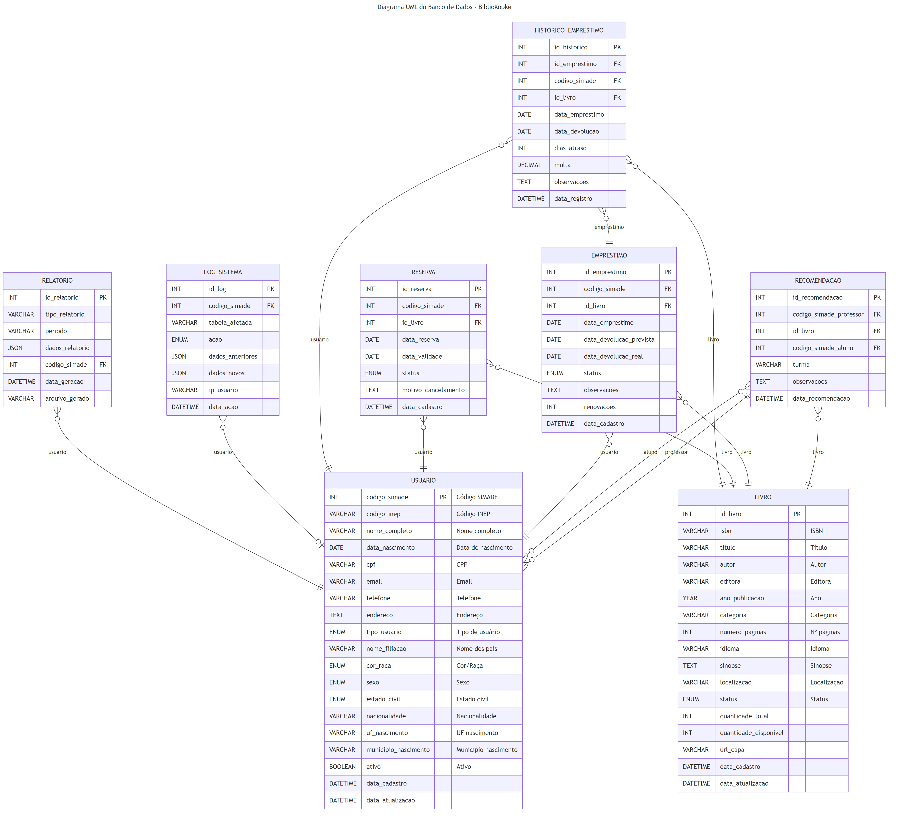

# ANEXO II - DIAGRAMA ENTIDADE-RELACIONAMENTO (DER)

**Projeto:** BiblioKopke - Sistema de Gestão de Biblioteca Escolar
**Modelo:** Relacional Normalizado (3FN)
**SGBD:** MySQL 8.0+

---

## Diagrama UML do Banco de Dados



**Arquivo de imagem:** [diagrama_uml_banco.png](../../04_diagramas/diagrama_uml_banco.png)

---

## Visão Geral do Modelo

O banco de dados foi projetado para atender às necessidades de gestão completa da biblioteca escolar, com integração planejada ao sistema SIMADE (Sistema Mineiro de Administração Escolar).

### Características Principais
- **Normalização:** 3ª Forma Normal (3FN)
- **Integridade referencial:** Garantida por chaves estrangeiras
- **Auditoria:** Sistema completo de logs
- **Rastreabilidade:** Histórico de todas as operações
- **Escalabilidade:** Preparado para crescimento do acervo e usuários

---

## Entidades e Relacionamentos

### 1. USUARIO
**Descrição:** Armazena dados de todos os usuários do sistema (alunos, professores e bibliotecários), integrado ao SIMADE.

**Chave Primária:** `codigo_simade` (VARCHAR)
- Utiliza o código do SIMADE como identificador único
- Garante integração futura com base de dados da secretaria

**Campos:**
| Campo | Tipo | Descrição | Obrigatório |
|-------|------|-----------|-------------|
| codigo_simade | VARCHAR(50) | Código único do SIMADE (PK) | Sim |
| codigo_inep | VARCHAR(20) | Código INEP da escola | Sim |
| nome_completo | VARCHAR(200) | Nome completo do usuário | Sim |
| data_nascimento | DATE | Data de nascimento | Sim |
| cpf | VARCHAR(14) | CPF formatado | Não |
| email | VARCHAR(100) | E-mail de contato | Não |
| telefone | VARCHAR(20) | Telefone com DDD | Não |
| endereco | TEXT | Endereço completo | Não |
| tipo_usuario | ENUM | ALUNO, PROFESSOR, BIBLIOTECARIO | Sim |
| nome_filiacao | VARCHAR(200) | Nome dos pais/responsáveis | Não |
| cor_raca | ENUM | Cor/Raça (IBGE) | Não |
| sexo | ENUM | M, F, OUTRO | Não |
| estado_civil | ENUM | Estado civil | Não |
| nacionalidade | VARCHAR(50) | Nacionalidade | Não |
| uf_nascimento | VARCHAR(2) | UF de nascimento | Não |
| municipio_nascimento | VARCHAR(100) | Município de nascimento | Não |
| ativo | BOOLEAN | Status do usuário | Sim (default: true) |
| data_cadastro | DATETIME | Data de cadastro | Sim (auto) |
| data_atualizacao | DATETIME | Data da última atualização | Sim (auto) |

**Relacionamentos:**
- 1:N com EMPRESTIMO
- 1:N com RESERVA
- 1:N com HISTORICO_EMPRESTIMO
- 1:N com LOG_SISTEMA
- 1:N com RELATORIO
- 1:N com RECOMENDACAO (como professor)

**Índices:**
- PRIMARY KEY: codigo_simade
- INDEX: cpf
- INDEX: tipo_usuario
- INDEX: ativo
- INDEX: nome_completo

---

### 2. LIVRO
**Descrição:** Cadastro completo do acervo de livros da biblioteca.

**Chave Primária:** `id_livro` (INT AUTO_INCREMENT)

**Campos:**
| Campo | Tipo | Descrição | Obrigatório |
|-------|------|-----------|-------------|
| id_livro | INT | Identificador único (PK) | Sim (auto) |
| isbn | VARCHAR(20) | ISBN do livro | Não |
| titulo | VARCHAR(200) | Título do livro | Sim |
| autor | VARCHAR(200) | Autor(es) do livro | Sim |
| editora | VARCHAR(100) | Editora | Não |
| ano_publicacao | YEAR | Ano de publicação | Não |
| categoria | VARCHAR(50) | Categoria/gênero | Não |
| numero_paginas | INT | Número de páginas | Não |
| idioma | VARCHAR(30) | Idioma do livro | Sim (default: Português) |
| sinopse | TEXT | Resumo do livro | Não |
| localizacao | VARCHAR(50) | Localização física na biblioteca | Não |
| url_capa | VARCHAR(255) | URL da capa (se houver) | Não |
| status | ENUM | DISPONIVEL, INDISPONIVEL, MANUTENCAO | Sim (default: DISPONIVEL) |
| quantidade_total | INT | Quantidade total de exemplares | Sim (default: 1) |
| quantidade_disponivel | INT | Quantidade disponível | Sim (default: 1) |
| data_cadastro | DATETIME | Data de cadastro | Sim (auto) |
| data_atualizacao | DATETIME | Data da última atualização | Sim (auto) |

**Relacionamentos:**
- 1:N com EMPRESTIMO
- 1:N com RESERVA
- 1:N com HISTORICO_EMPRESTIMO
- 1:N com RECOMENDACAO

**Índices:**
- PRIMARY KEY: id_livro
- UNIQUE: isbn (se não NULL)
- INDEX: titulo
- INDEX: autor
- INDEX: categoria
- INDEX: status

**Regras de Negócio:**
- quantidade_disponivel <= quantidade_total
- status = INDISPONIVEL quando quantidade_disponivel = 0
- Trigger atualiza automaticamente após empréstimo/devolução

---

### 3. EMPRESTIMO
**Descrição:** Controle de empréstimos ativos de livros.

**Chave Primária:** `id_emprestimo` (INT AUTO_INCREMENT)

**Campos:**
| Campo | Tipo | Descrição | Obrigatório |
|-------|------|-----------|-------------|
| id_emprestimo | INT | Identificador único (PK) | Sim (auto) |
| codigo_simade | VARCHAR(50) | Usuário que pegou emprestado (FK) | Sim |
| id_livro | INT | Livro emprestado (FK) | Sim |
| data_emprestimo | DATE | Data do empréstimo | Sim |
| data_devolucao_prevista | DATE | Data prevista de devolução | Sim |
| data_devolucao_real | DATE | Data real de devolução | Não |
| status | ENUM | ATIVO, DEVOLVIDO, ATRASADO, RENOVADO | Sim (default: ATIVO) |
| observacoes | TEXT | Observações sobre o empréstimo | Não |
| renovacoes | INT | Número de renovações realizadas | Sim (default: 0) |
| data_cadastro | DATETIME | Data de registro | Sim (auto) |

**Relacionamentos:**
- N:1 com USUARIO (codigo_simade)
- N:1 com LIVRO (id_livro)
- 1:1 com HISTORICO_EMPRESTIMO (após devolução)

**Índices:**
- PRIMARY KEY: id_emprestimo
- FOREIGN KEY: codigo_simade → usuario
- FOREIGN KEY: id_livro → livro
- INDEX: status
- INDEX: data_devolucao_prevista
- INDEX: data_emprestimo

**Regras de Negócio:**
- Prazo padrão: 7 dias (configurável)
- Máximo de renovações: 2 (configurável)
- Aluno não pode ter mais de 3 empréstimos ativos
- Professor não pode ter mais de 5 empréstimos ativos
- Não pode emprestar livro já emprestado (quantidade_disponivel > 0)
- Status muda para ATRASADO automaticamente (trigger diário)

---

### 4. RESERVA
**Descrição:** Sistema de reservas para livros indisponíveis.

**Chave Primária:** `id_reserva` (INT AUTO_INCREMENT)

**Campos:**
| Campo | Tipo | Descrição | Obrigatório |
|-------|------|-----------|-------------|
| id_reserva | INT | Identificador único (PK) | Sim (auto) |
| codigo_simade | VARCHAR(50) | Usuário que reservou (FK) | Sim |
| id_livro | INT | Livro reservado (FK) | Sim |
| data_reserva | DATE | Data da reserva | Sim |
| data_validade | DATE | Data de validade da reserva | Sim |
| status | ENUM | ATIVA, ATENDIDA, CANCELADA, EXPIRADA | Sim (default: ATIVA) |
| motivo_cancelamento | TEXT | Motivo do cancelamento (se houver) | Não |
| data_cadastro | DATETIME | Data de registro | Sim (auto) |

**Relacionamentos:**
- N:1 com USUARIO (codigo_simade)
- N:1 com LIVRO (id_livro)

**Índices:**
- PRIMARY KEY: id_reserva
- FOREIGN KEY: codigo_simade → usuario
- FOREIGN KEY: id_livro → livro
- INDEX: status
- INDEX: data_validade

**Regras de Negócio:**
- Validade: 3 dias após disponibilidade (configurável)
- Fila de reservas: ordem cronológica
- Notificação quando livro ficar disponível
- Expiração automática após prazo (trigger)
- Máximo 2 reservas ativas por usuário

---

### 5. HISTORICO_EMPRESTIMO
**Descrição:** Registro histórico permanente de todos os empréstimos.

**Chave Primária:** `id_historico` (INT AUTO_INCREMENT)

**Campos:**
| Campo | Tipo | Descrição | Obrigatório |
|-------|------|-----------|-------------|
| id_historico | INT | Identificador único (PK) | Sim (auto) |
| id_emprestimo | INT | Referência ao empréstimo (FK) | Sim |
| codigo_simade | VARCHAR(50) | Usuário (FK) | Sim |
| id_livro | INT | Livro (FK) | Sim |
| data_emprestimo | DATE | Data do empréstimo | Sim |
| data_devolucao | DATE | Data da devolução | Sim |
| dias_atraso | INT | Dias de atraso | Sim (default: 0) |
| multa | DECIMAL(10,2) | Valor da multa (se houver) | Sim (default: 0.00) |
| observacoes | TEXT | Observações | Não |
| data_registro | DATETIME | Data de registro no histórico | Sim (auto) |

**Relacionamentos:**
- N:1 com EMPRESTIMO (id_emprestimo)
- N:1 com USUARIO (codigo_simade)
- N:1 com LIVRO (id_livro)

**Índices:**
- PRIMARY KEY: id_historico
- FOREIGN KEY: id_emprestimo → emprestimo
- FOREIGN KEY: codigo_simade → usuario
- FOREIGN KEY: id_livro → livro
- INDEX: data_emprestimo
- INDEX: data_devolucao

**Regras de Negócio:**
- Inserção automática via trigger após devolução
- Registro permanente (não pode ser excluído)
- Cálculo automático de dias_atraso e multa

---

### 6. LOG_SISTEMA
**Descrição:** Auditoria completa de todas as operações no sistema.

**Chave Primária:** `id_log` (INT AUTO_INCREMENT)

**Campos:**
| Campo | Tipo | Descrição | Obrigatório |
|-------|------|-----------|-------------|
| id_log | INT | Identificador único (PK) | Sim (auto) |
| codigo_simade | VARCHAR(50) | Usuário que executou ação (FK) | Não |
| tabela_afetada | VARCHAR(50) | Nome da tabela afetada | Sim |
| acao | ENUM | INSERT, UPDATE, DELETE | Sim |
| dados_anteriores | JSON | Dados antes da alteração | Não |
| dados_novos | JSON | Dados após alteração | Não |
| ip_usuario | VARCHAR(45) | IP do usuário | Não |
| data_acao | DATETIME | Data/hora da ação | Sim (auto) |

**Relacionamentos:**
- N:1 com USUARIO (codigo_simade) - Opcional

**Índices:**
- PRIMARY KEY: id_log
- FOREIGN KEY: codigo_simade → usuario (ON DELETE SET NULL)
- INDEX: tabela_afetada
- INDEX: acao
- INDEX: data_acao

**Regras de Negócio:**
- Inserção automática via triggers
- Registro permanente (não pode ser excluído/alterado)
- Útil para auditoria e rastreabilidade

---

### 7. RELATORIO
**Descrição:** Armazenamento de relatórios gerados pelo sistema.

**Chave Primária:** `id_relatorio` (INT AUTO_INCREMENT)

**Campos:**
| Campo | Tipo | Descrição | Obrigatório |
|-------|------|-----------|-------------|
| id_relatorio | INT | Identificador único (PK) | Sim (auto) |
| tipo_relatorio | VARCHAR(100) | Tipo do relatório | Sim |
| periodo | VARCHAR(50) | Período do relatório | Não |
| dados_relatorio | JSON | Dados do relatório em JSON | Não |
| codigo_simade | VARCHAR(50) | Usuário que gerou (FK) | Não |
| data_geracao | DATETIME | Data de geração | Sim (auto) |
| arquivo_gerado | VARCHAR(255) | Caminho do arquivo (PDF/CSV) | Não |

**Relacionamentos:**
- N:1 com USUARIO (codigo_simade)

**Índices:**
- PRIMARY KEY: id_relatorio
- FOREIGN KEY: codigo_simade → usuario
- INDEX: tipo_relatorio
- INDEX: data_geracao

---

### 8. RECOMENDACAO (Nova Funcionalidade)
**Descrição:** Sistema de recomendações de livros por professores para alunos.

**Chave Primária:** `id_recomendacao` (INT AUTO_INCREMENT)

**Campos:**
| Campo | Tipo | Descrição | Obrigatório |
|-------|------|-----------|-------------|
| id_recomendacao | INT | Identificador único (PK) | Sim (auto) |
| codigo_simade_professor | VARCHAR(50) | Professor que recomendou (FK) | Sim |
| id_livro | INT | Livro recomendado (FK) | Sim |
| codigo_simade_aluno | VARCHAR(50) | Aluno para quem foi recomendado (FK) | Sim |
| turma | VARCHAR(50) | Turma do aluno | Não |
| observacoes | TEXT | Observações do professor | Não |
| data_recomendacao | DATETIME | Data da recomendação | Sim (auto) |

**Relacionamentos:**
- N:1 com USUARIO (codigo_simade_professor)
- N:1 com USUARIO (codigo_simade_aluno)
- N:1 com LIVRO (id_livro)

**Índices:**
- PRIMARY KEY: id_recomendacao
- FOREIGN KEY: codigo_simade_professor → usuario
- FOREIGN KEY: codigo_simade_aluno → usuario
- FOREIGN KEY: id_livro → livro
- INDEX: turma
- INDEX: data_recomendacao

---

## Relacionamentos Detalhados

```
USUARIO 1:N EMPRESTIMO
USUARIO 1:N RESERVA
USUARIO 1:N HISTORICO_EMPRESTIMO
USUARIO 1:N LOG_SISTEMA
USUARIO 1:N RELATORIO
USUARIO 1:N RECOMENDACAO (como professor)
USUARIO 1:N RECOMENDACAO (como aluno)

LIVRO 1:N EMPRESTIMO
LIVRO 1:N RESERVA
LIVRO 1:N HISTORICO_EMPRESTIMO
LIVRO 1:N RECOMENDACAO

EMPRESTIMO 1:1 HISTORICO_EMPRESTIMO
```

---

## Triggers Implementados

### 1. trg_atualiza_disponibilidade_emprestimo
**Evento:** AFTER INSERT em EMPRESTIMO
**Ação:**
- Decrementa quantidade_disponivel do livro
- Atualiza status do livro para INDISPONIVEL se quantidade_disponivel = 0

### 2. trg_atualiza_disponibilidade_devolucao
**Evento:** AFTER UPDATE em EMPRESTIMO (quando data_devolucao_real é preenchida)
**Ação:**
- Incrementa quantidade_disponivel do livro
- Atualiza status do livro para DISPONIVEL
- Insere registro em HISTORICO_EMPRESTIMO

### 3. trg_auditoria_usuario_insert
**Evento:** AFTER INSERT em USUARIO
**Ação:** Registra inserção em LOG_SISTEMA

### 4. trg_auditoria_usuario_update
**Evento:** AFTER UPDATE em USUARIO
**Ação:** Registra alteração em LOG_SISTEMA (com dados anteriores e novos)

### 5. trg_auditoria_livro_insert
**Evento:** AFTER INSERT em LIVRO
**Ação:** Registra inserção em LOG_SISTEMA

### 6. trg_auditoria_livro_update
**Evento:** AFTER UPDATE em LIVRO
**Ação:** Registra alteração em LOG_SISTEMA

---

## Procedures Implementadas

### 1. sp_realizar_emprestimo
**Parâmetros:**
- IN p_codigo_simade VARCHAR(50)
- IN p_id_livro INT
- IN p_prazo_dias INT (default: 7)
- OUT p_id_emprestimo INT

**Função:** Realiza empréstimo com todas as validações

**Validações:**
- Usuário existe e está ativo
- Livro existe e está disponível
- Usuário não excedeu limite de empréstimos
- Usuário não tem empréstimos atrasados

### 2. sp_realizar_devolucao
**Parâmetros:**
- IN p_id_emprestimo INT
- OUT p_dias_atraso INT
- OUT p_valor_multa DECIMAL(10,2)

**Função:** Realiza devolução com cálculo de multa

**Ações:**
- Calcula dias de atraso
- Calcula multa (R$ 1,00 por dia - configurável)
- Atualiza status do empréstimo
- Trigger insere em histórico

### 3. sp_renovar_emprestimo
**Parâmetros:**
- IN p_id_emprestimo INT
- IN p_prazo_adicional INT (default: 7)

**Função:** Renova empréstimo

**Validações:**
- Empréstimo está ativo
- Não excedeu limite de renovações (máximo 2)
- Não há reservas para o livro

### 4. sp_criar_reserva
**Parâmetros:**
- IN p_codigo_simade VARCHAR(50)
- IN p_id_livro INT
- OUT p_id_reserva INT

**Função:** Cria reserva

**Validações:**
- Livro está indisponível
- Usuário não tem mais de 2 reservas ativas
- Usuário não tem o livro emprestado

---

## Views Úteis

### 1. vw_emprestimos_ativos
Lista todos os empréstimos ativos com informações completas de usuário e livro

### 2. vw_emprestimos_atrasados
Lista empréstimos atrasados com cálculo de dias de atraso e multa

### 3. vw_livros_populares
Ranking dos livros mais emprestados (histórico completo)

### 4. vw_reservas_ativas
Lista todas as reservas ativas com informações de usuário e livro

### 5. vw_acervo_disponibilidade
Resumo do acervo: total, disponível, emprestado, em manutenção

---

## Dados Iniciais (Seed Data)

### Usuário Bibliotecário Padrão
```sql
codigo_simade: 'ADM001'
nome_completo: 'Administrador Sistema'
tipo_usuario: 'BIBLIOTECARIO'
senha: hash('admin123')
```

### Livros de Exemplo
- 20 livros variados para testes
- Categorias: Ficção, Romance, Suspense, Biografia, Técnico

---

## Arquivo SQL Completo

**Localização:** [02_modelagem_banco/banco_de_dados.sql](../../02_modelagem_banco/banco_de_dados.sql)

Contém:
- CREATE DATABASE
- CREATE TABLE (todas as 8 tabelas)
- CREATE INDEX
- CREATE TRIGGER (6 triggers)
- CREATE PROCEDURE (4 procedures)
- CREATE VIEW (5 views)
- INSERT dados iniciais

---

## Observações Técnicas

### Integridade Referencial
- Todas as foreign keys com ON DELETE CASCADE ou SET NULL conforme lógica de negócio
- Constraints garantem consistência dos dados

### Performance
- Índices criados em campos frequentemente consultados
- Views pré-calculadas para consultas complexas
- Procedures otimizadas para operações frequentes

### Segurança
- Senhas armazenadas com hash SHA256
- Logs de auditoria completos
- Rastreabilidade de todas as operações

### Escalabilidade
- Modelo preparado para grande volume de dados
- Particionamento possível em tabelas de log e histórico
- Arquivamento de dados antigos facilitado

---

**Documento elaborado em:** 01/outubro/2025
**Última atualização:** 01/outubro/2025
**Versão do modelo:** 1.0
